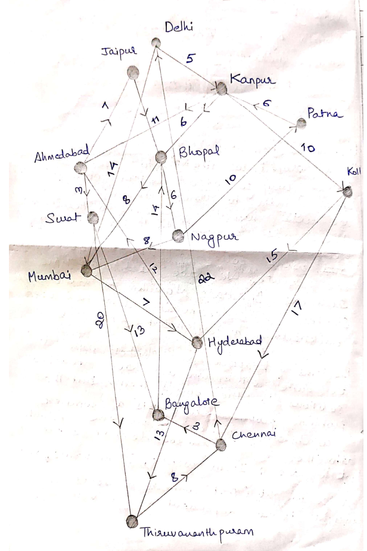

# Hyperloop-Logistics
An algorithmic approach to effectively manage exports in India using Hyperloop trains ;-)

In this project, I have attempted to design an algorithm to effectively export cargo from 
different cities in India to other parts of the world in the most cost effective and
profitable manner. I have used algorithms such as Dijkstra’s for finding the most cost
effective path between the starting city and end city from where the cargo will go
overseas. Knapsack has been implemented to load the cargo in our carriage such that the
profit is maximum.

I have taken 14 major cities of India whose names we have provided in our map and also at the
start of our program. First step is to find the best route possible between the start and the
end point cities. This is accomplished by the help of Dijkstra’s Algorithm. Now, once the
cities have been computed for route, the carriage will run through all these junction
cities and pick up cargo from these places. Here effective allocation of carriage space
is essential to ensure most profitable loading of cargo. Here I use the concept of
knapsack (0/1). In order to make my program more robust, I have added **one more parameter
of priority** to the existential parameters item weight and item value. To manipulate my
program according to priority, I have added a factor of 100 to the profit of items with
priority. This is because, we always need to strike the right balance between priority and
over all cost of the whole journey

**Map for logistics**

